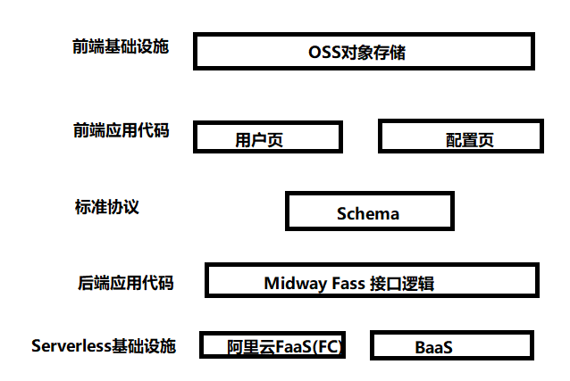

# My Code World &middot;  

Hi！Welcome to **My Code World** (personal website). The general introduction is as follows:

* **interactive UIs by React:** React is a JavaScript library for building user interfaces.Here I will demonstrate the extreme usage of CSS.
* **React+Configuration+Serverless:** Different full stack development experience! This includes: React(Hooks+Redux+React Router+immer+webpack+Ant Design)+MidwayFaas(TypeORM+MySQL+Ali Cloud FC+Authing).
* **Machine Learning in Practice:** Compared with traditional website development, take you to experience the collision between artificial intelligence and website development.

> ⚠ Note:
> [Want to get to know me briefly? Click 🔗 to take a few minutes to learn about me and the code I'm writing](https://github.com/yinleiCoder).

## Prerequisites

To install and run this project, your development environment must meet these minimum requirements:

> ⚠ Note:
> To check your Windows version and build number, select Windows logo key + R, type winver, select OK. You can update to the latest Windows version by selecting Start > Settings > Windows Update > Check for updates.

    
Expand to view details

    Operating Systems: Windows 10 or later(64-bit), x86-64 based.

     Disk Space: 1.64GB(does not include disk space for IDE/tools)

     Settings: Developer Mode must be enabled on Windows 10/11

     Tools: Project depends on these tools being available in your environment: Windows PowerShell 5.0 or newer(this is pre-installed with Windows 10),Git for Windows 2.x, with the Use Git frome the Windows Command Prompt option. If Git for Windows is already installed, make sure you can run git commands from the command prompt or PowerShell

     IDE: Visual Studio Code.

     Node: v16.15.0 LTS (include npm version 8.5.5). Of course, you can switch the node version by `nvm`.

     React: v18.x

     Browser: Chrome. You are free to choose your own preferred browser(for example: Firefox)

Of course, the above is my current configuration, you can change according to the actual situation.

## Architecture

> ⚠ Note:
> You can view the progress of the current project by selecting Projects > Project.

## Contributing

If you are interested in this project, please feel free to contact me to join us and let us program happily together.
Of course, you are also welcome to actively raise issues.  
Thank you!!!

## Star

## License

**My Code World** is [GPL-3.0 licensed](./LICENSE).
